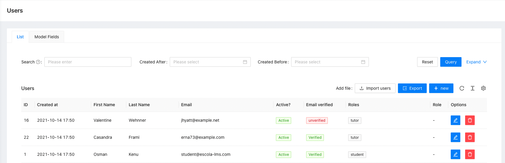

# CSV-Users

## What does it do

This package is used to export and import users in the `.csv` format. 

## Installation

- `composer require ulams/csv-users`
- `php artisan db:seed --class="Ulams\CsvUsers\Database\Seeders\CsvUsersPermissionSeeder"`

## Example

|id |name             |first_name|last_name|email             |country|is_active|created_at                 |onboarding_completed|email_verified|interests|avatar                                                         |roles    |permissions         |path_avatar           |contact |bio |
|---|-----------------|----------|---------|------------------|-------|---------|---------------------------|--------------------|--------------|---------|---------------------------------------------------------------|---------|--------------------|----------------------|--------|----|
|16 |Valentine Wehnner|Valentine |Wehnner  |jhyatt@example.net|Poland |         |2021-10-14T15:50:28.000000Z|TRUE                |TRUE          |LMS      |localhost/storage/avatars/16/logo.png                          |["tutor"]|["access dashboard"]|avatars/16/logo.png   |1234567 |bio |

- Export uses fields from `Ulams\Auth\Http\Resources\UserFullResource`

- Import uses the `update` or `create` method from `Ulams\Auth\Repositories\Contracts\UserRepositoryContract`.
If the email exists in the database, the user's data is updated. Otherwise, a new user is created.

## Endpoints

All the endpoints are defined in 

## Tests

Run `./vendor/bin/phpunit` to run tests. Test details

## Events 

- `Ulams\CsvUsers\Events\UlamsImportedNewUserTemplateEvent` => Event is dispatched after importing a new user.

## How to use this on frontend

### Admin panel

**Import and export button**

## Permissions

Permissions are defined in [seeder](database/seeders/CsvUsersPermissionSeeder.php)
