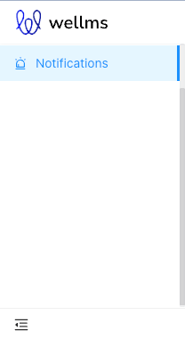
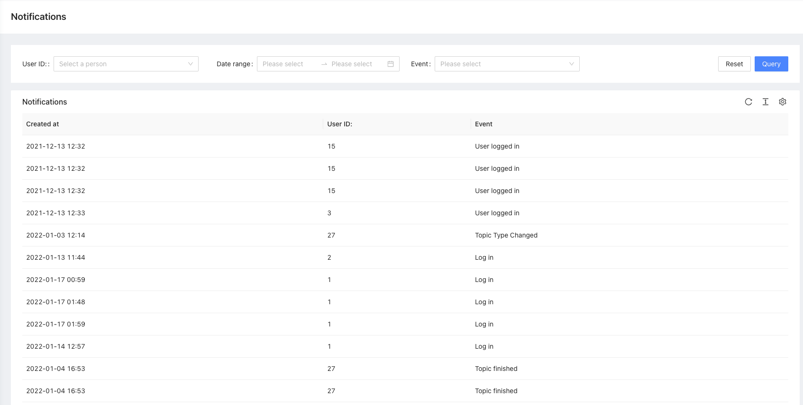

# Notifications

Notifications package

## What does it do

This package is used for logging and broadcasting notifications for all `Ulams` packages events.

## Installation

- `composer require ulams/notifications`
- `php artisan migrate`
- `php artisan db:seed --class="Ulams\Notifications\Database\Seeders\NotificationsPermissionsSeeder"`

## Usage

All events emitted by Ulams packages will be logged in database and can be listed through API (and Admin Panel).
There is a configuration file in which you can define events which should be excluded from being stored.

## Endpoints

All the endpoints are defined in 

## Tests

Run `./vendor/bin/phpunit --filter 'Ulams\\Notifications\\Tests'` to run tests. See [tests](tests) folder as it's quite good staring point as documentation appendix.

Test details:

### Admin panel

#### **Left menu**

#### **List of notifications**

## Permissions

Permissions are defined in [seeder](database/seeders/NotificationsPermissionsSeeder.php)

## Events

No Events are defined in this package.

## Listeners

- `Ulams\Notifications\Listeners\NotifiableEventListener` - this listener listens to all events in `Ulams` namespace

## Roadmap. Todo. Troubleshooting

- ???
