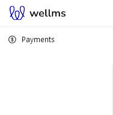
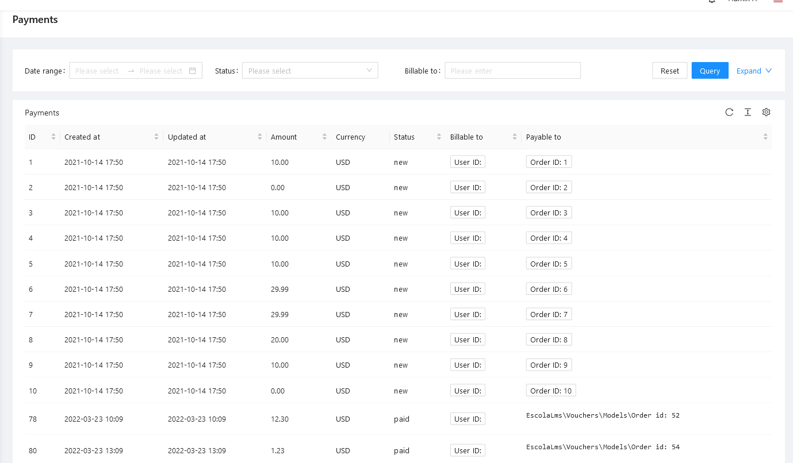

# Payments


## Purpose

This package lets you create Payments and process them using integrations with external payment providers (gateways).

## Dependencies

- Stripe integration is based on `league/omnipay` and `omnipay/stripe` packages.
- Przelewy24 integration is based on `mnastalski/przelewy24-php` package.
- Optional integration with `ulams/settings` package enables changing payment gateway api keys & secrets using Settings API (and Admin Panel).

## Installation

- `composer require ulams/payments`
- `php artisan migrate`
- `php artisan db:seed --class="Ulams\Cart\Database\Seeders\CartPermissionSeeder"`

## Usage

### Facades

#### Payments Facade

Use `Ulams\Payments\Facades\Payments` for starting payment processing.
You can create PaymentProcessor` either from a model using Payable trait or from precreated Payment object.

```php
use Ulams\Cart\Models\Cart;
use Ulams\Payments\Dtos\PaymentMethodDto;
use Ulams\Payments\Facades\Payments;

$payable = Cart::find($id); // Cart must implement Payable interface and use Payable trait
$paymentMethodDto = PaymentMethodDto::instantiateFromRequest($request);
$processor = Payments::processPayment($payable);
$processor->purchase($paymentMethodDto); // will emit PaymentPaid event on success
if($payment->status->is(PaymentStatus::PAID)){
    // ...
}
```

#### PaymentGateway Facade

With `Ulams\Payments\Facades\PaymentGateway` you can call payment provider gateways directly.

For existing payment you can for example do:

```php
use Ulams\Payments\Dtos\PaymentMethodDto;
use Ulams\Payments\Facades\PaymentGateway;
use Ulams\Payments\Models\Payment;

$payment = Payment::find($id);
$paymentMethodDto = PaymentMethodDto::instantiateFromRequest($request);
$paymentDto = PaymentDto::instantiateFromPayment($payment); // or you can create it manually
PaymentGateway::purchase($paymentDto, $paymentMethodDto); // will use default payment driver
```

**Important**: This will not save `Payment` object.

To use specific driver, you can call

```php
PaymentGateway::driver('stripe')->purchase($paymentDto, $paymentMethodDto);
```

#### Available payment drivers

- **stripe** (using `Stripe Payment Intent`)
- **free**
- **przelewy24**
- TODO: _stripe-checkout_

### Payable Trait & Interface

`Payable` trait and interface are the core of this package, enabling simplified calling of `PaymentsService` and `GatewayManager`.
When you include it in your model that represents a `Payable` (for example `Cart` or `Order` or `Product`) you can begin payment processing for that `Payable` by calling `$payable->process()`
which calls `Payments::processPayable($this)` and automatically creates a `Payment` and returns a `PaymentProcessor` instance for that Payment.

`Ulams\Cart` package uses this trait and interface in `Ulams\Cart\Models\Order`.

### Payment Processor

`Ulams\Payments\Entities\PaymentProcessor` is a special class which wraps around `Payment`
and contains functionality related to processing that payment, for example generating links to payment gateways, automatically setting payment status after purchase, emiting events related to payment status, etc.

```php
use Ulams\Payments\Dtos\PaymentMethodDto;
use Ulams\Payments\Entities\PaymentProcessor;
use Ulams\Payments\Models\Payment;

$payment = Payment::find($id);
$paymentMethodDto = PaymentMethodDto::instantiateFromRequest($request);
$processor = new PaymentProcessor($payment); // instead of using Payments facade
$processor->purchase($paymentMethodDto);
```

`PaymentProcessor` automatically selects `free` driver when payment amount equals 0.

### Payment Model

This package defines a `Ulams\Payments\Models\Payment` which contains all data abount given payment required for payment gateways to work.

## Endpoints

All the endpoints are defined in [](https://ulams.github.io/payments/).

## Tests

Run `./vendor/bin/phpunit` to run tests. See [tests/Mocks/Payable](tests/Mocks/Payable.php) as an example how a Payable is defined.

Test details: [](https://codecov.io/gh/Ulams/payments)

## Events

- `Ulams\Payments\Events\PaymentCancelled` - - emited after payment processing is cancelled (by user action or possibly by timeout sent from payment gateway)
- `Ulams\Payments\Events\PaymentFailed` - emited after payment has failed (payment gateway returns error)
- `Ulams\Payments\Events\PaymentRegistered` - emited when new Payment is created
- `Ulams\Payments\Events\PaymentSuccess` - emited when payment gateway returns success

## Listeners

No Listeners are defined in this package.

## How to use this package on Frontend

### Admin Panel

#### **Left Menu**



#### **List of Payments**



## Permissions

Permissions are defined in [Enum](src/Enums/CartPermissionsEnum.php) and seeded in [Seeder](database/seeders/CartPermissionSeeder.php).

## Roadmap. Todo. Troubleshooting

- ???
