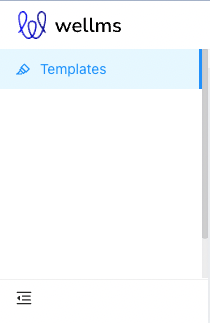
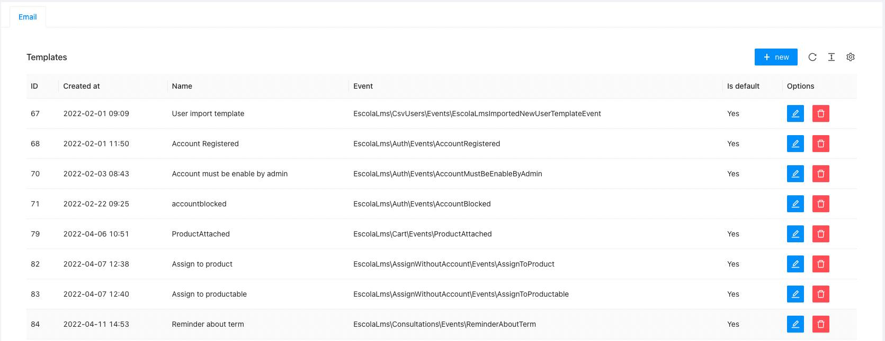
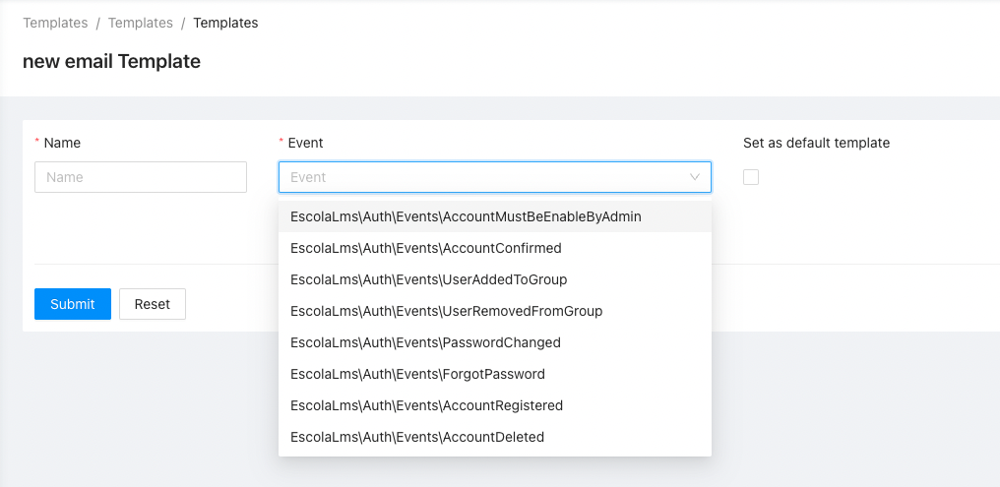

# Templates-PDF

Package for generating PDFs from configurable Templates.

## Purpose

This package allows you to create PDFs generated after a specific Event is emitted in Laravel / LMS app.

Each PDF Template has a corresponding class describing available variables that can be used in the Template (which will be stored in database and editable through admin panel).
Templates are stored as [pdfme](https://pdfme.com) JSON (the `content` section) and designed in the admin
pdfme designer. A field named after a variable (e.g. `@VarUserName`) is filled with its value; variables
typed into read-only text (`Issued by @VarAppName` or `${VarAppName}`) are replaced in place. PDFs are
rendered by the `api/pdf` service (see `api/pdf/README.md`).

## PDF rendering

- When an event is handled, a `FabricPDF` record keeps the template as designed and the variables; the PDF
  is rendered once through the renderer and stored on the `storage.disk` (default filesystem) under
  `pdfs/<user>/<certificate id>.pdf`. If the renderer is down, the record is still created and the PDF is
  rendered on download.
- `GET /api/pdfs/generate/{id}` downloads it (owner or `fabricjs_pdf_read_all`); 422 for legacy/invalid
  templates, 503 when the renderer is unavailable.
- `POST /api/admin/pdfs/preview` `{event, content}` renders unsaved designer content with the mocked
  variables of the event (`template_create` or `template_update` permission).
- `GET /api/pdfs/fonts` and `/api/pdfs/fonts/{file}` (public) proxy the renderer's OFL fonts for the designer.
- Every PDF gets `@VarCertificateId` (random UUID, also `fabric_pdfs.certificate_id`) and
  `@VarCertificateVerifyUrl` (`verify_url`, default `{APP_URL}/certificates/verify/{id}`; the verification
  page is not built yet), which the default certificate encodes as a QR code.

Config (`ulams_templates_pdf`): `pdf.service_url` (`PDF_SERVICE_URL`, default `http://pdf:3000`),
`pdf.internal_token` (`PDF_INTERNAL_TOKEN`), `pdf.timeout`, `storage.disk` / `storage.directory` /
`storage.render_on_create`, `verify_url` (`PDF_CERTIFICATE_VERIFY_URL`, placeholders `{APP_URL}`,
`{FRONTEND_URL}`, `{id}`).

Certificate templates (`resources/pdfme`, built by `api/pdf/scripts/certificate-templates.mjs`): `default`
(A4 landscape; seeded as the default `CourseFinished` template) and `coffee`, `oncall`, `nightsky` for the
demo experiences — `CertificateTemplates::content('coffee')` returns the JSON for a template's `content`
section. A template's `title` section must contain `@VarCourseTitle` for `CourseFinished` templates to be valid.

## Migrating from ReportBro

ReportBro (AGPL) was removed. ReportBro reports cannot be converted reliably, so the migration
`2026_10_08_000002_convert_reportbro_pdf_templates_to_pdfme` (same as
`php artisan templates-pdf:migrate-reportbro [--dry-run] [--reset]`):

- converts simple elements of every ReportBro PDF template: text (a text that is only `${VarX}` becomes a
  field `@VarX`), lines and embedded PNG/JPEG images; everything else is dropped and listed;
- replaces the auto-created `Default template for event …` templates (and, with `--reset`, all of them)
  with the new default template of their event;
- prefixes converted template names with `[Converted from ReportBro] ` so admins review them in the designer;
- converts issued PDFs (`fabric_pdfs.content`) the same way so they stay downloadable;
- backs up every original to `storage/app/reportbro-legacy/<timestamp>.jsonl`.

The admin designer shows ReportBro templates that were not migrated as legacy and offers to start over
from the default template.

Class describing Template Variables must be registered using Template facade from `Ulams\Template` package, where you specify which Event it is associated with it and which Channel it is sent through (e.g. `Ulams\TemplatesPdf\Core\PdfChannel` which is defined in this package).

## Installing

- `composer require ulams/templates-pdf`
- `php artisan migrate`
- `php artisan db:seed --class="Ulams\TemplatesPdf\Database\Seeders\TemplatesPdfSeeder"` to create default templates for all Variable/Event pairs registered for PDF channel

## Dependencies

- `Ulams\Templates` core Templates package
- optional: `Ulams\Courses` for generating PDFs related to Courses

## Usage

### Defining Templates

1. Create Event which triggers generation of PDF using specified template. This event must implement method `getUser()` returning User model from LMS Core package.
2. Create class defining template Variables, which you will use in PDF template,
3. Associate your class describing template Variables with correct Event and Channel. Use `Ulams\Templates\Facades\Template::register(Event class, Ulams\TemplatesPdf\Core\PdfChannel::class, Variable class);` method.
4. Use admin panel or `/api/admin/templates` web API to create/edit templates associated with this Variable/Event/Channel set. See [Template package](https://github.com/EscolaLMS/Templates) for more information.

## Tests

Run `./vendor/bin/phpunit --filter 'Ulams\\TemplatesPdf\\Tests'` to run tests. See [tests](tests) folder as it contains a basic implementation of Variables class (description of what Template can/must contain) with minimal customisation - a quite good starting point for creating your own.

Test details:

## Usage on front end

### Admin panel

#### **Left menu**

#### **List of templates**

#### **Creating/editing template**

## Permissions

Permissions are defined in [Enum](src/Enums/PdfPermissionsEnum.php) and seeded in [Seeder](database/seeders/PermissionTableSeeder.php).

## Roadmap. Todo. Troubleshooting

- ???
