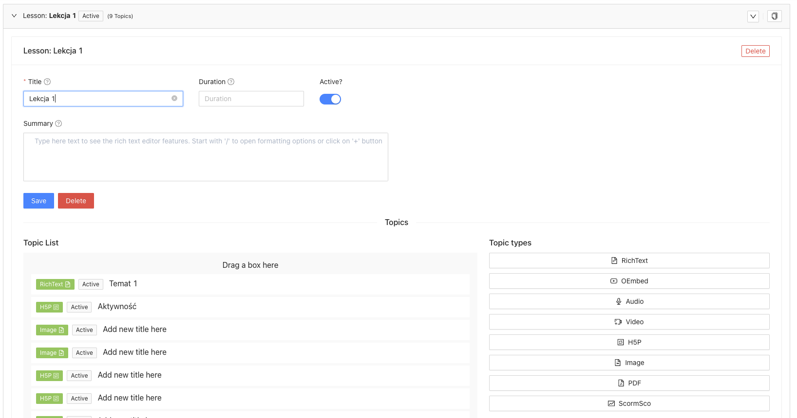

# Topic Types
Extending package for courses

## What does it do
This repository stores code for Ulams Content Topic types. At the moment there are the following types:

- **Audio**.
- **H5P**. [Reusable Interactive HTML5 Content](https://h5p.org/)
- **Image**.
- **oEmbed**. oEmbed is a format for allowing an [embedded representation](https://oembed.com/) of a URL on third party sites.
- **RichText**. Markdown rich texts. Like github readme files
- **Video**. Video with possible conversion to HLS format.
- **PDF**.

Those types are used for building headless Course.

## Installing
This package is installing with package course - See [TopicTypes](https://github.com/EscolaLMS/topic-types)

## Adding new Content Types

It's possible to add any new content type, for example HTML Text.

See [Courses readme](https://github.com/EscolaLMS/Courses#adding-new-topiccontent-type) for tutorial

## Tests

Run `./vendor/bin/phpunit --filter 'Ulams\\TopicTypes\\Tests'` to run tests. See [tests](tests) folder as it's quite good staring point as documentation appendix.

Test details  

## Events

- `Ulams\TopicTypes\Events\TopicTypeChanged` => Event is dispatched when topic type value is changed.

### Admin panel

**Add topic type to lesson**

