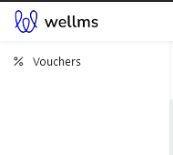
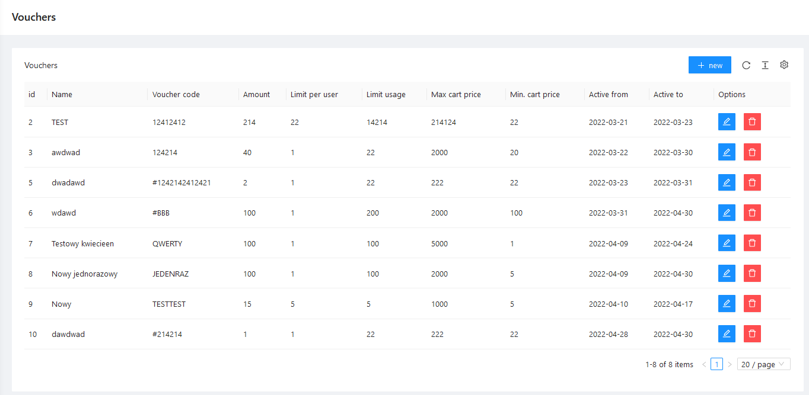
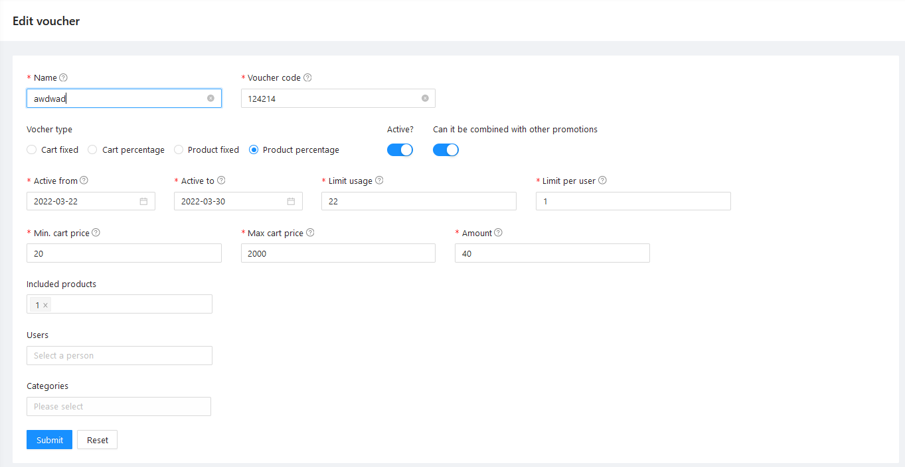

# Vouchers

## Purpose

This package lets you define Coupons that can be applied to User Cart before placing an Order, calculating a discount depending on multiple different, configurable rules.

## Installation

- `composer require ulams/vouchers`
- `php artisan migrate`
- `php artisan db:seed --class="Ulams\Vouchers\Database\Seeders\VoucherPermissionsSeeder"`

## Dependencies

This package depends (and extends) on [Ulams/Cart](https://github.com/EscolaLMS/Cart) package and can not be used separately.

## Usage

### Coupon rules

Every coupon defines set of rules that are checked when User tries to add Coupon to Cart.
Only if all conditions are met, coupon (discount) can be applied to given Cart content.
Some of the conditions work differently depending on type of coupon.

- **Min/max amount** - cart value must be at least "min" amount, and if cart value is above "max" amount, discount is only calculated as if value was at the "max" level
- **Usage limits** - coupons can not be used after their global or per user limits are reached
- **Exclude promotions** - coupon can not be used if products with already discounted price are in the Cart

### Types of coupon

This package defines four type of discounts, that represent four separate strategies for calculating discount.
There are two types that relate to whole Cart and two types that relate to specified Products.

#### **Fixed Cart amount coupon**

Coupon of type `Ulams\Vouchers\Enums::CART_FIXED` substracts constant amount from total price of Cart. See [`Ulams\Vouchers\Strategies\CartFixedDiscountStrategy`](src/Strategies/CartFixedDiscountStrategy.php).

- At least one of "included products" must be in Cart
- None of "excluded products" must be in Cart
- At least one of "included categories" must be in Cart
- None of "exclude categories" must be in Cart

#### **Percent Cart amount coupon**

Coupon of type `Ulams\Vouchers\Enums::CART_PERCENT` substracts percentage based amount from total price of Cart, but only for Products not in "excluded products" or "excluded categories" list. See [`Ulams\Vouchers\Strategies\CartPercentDiscountStrategy`](src/Strategies/CartPercentDiscountStrategy.php).

- At least one of "included products" must be in Cart
- At least one of "included categories" must be in Cart

#### **Fixed Product coupon**

Coupon of type `Ulams\Vouchers\Enums::PRODUCT_FIXED` substracts constant amount from Product price, but only once per unique Product. Product must be specified in "included products". See [`Ulams\Vouchers\Strategies\ProductFixedDiscountStrategy`](src/Strategies/ProductFixedDiscountStrategy.php).

#### **Percent Product coupon**

Coupon of type `Ulams\Vouchers\Enums::PRODUCT_FIXED` substracts percentage based amount from Product price. Product must be specified in "included products". See [`Ulams\Vouchers\Strategies\ProductPercentDiscountStrategy`](src/Strategies/ProductPercentDiscountStrategy.php).

### How to use Coupon

Coupon can be added to Cart using `POST /api/cart/voucher/` endpoint.

## Endpoints

All the endpoints are defined in .

## Tests

Run `./vendor/bin/phpunit` to run tests. See [tests](tests) directory.

Test details  

## Events

There are no events emitted by this package.

## Listeners

There are no listeners specified in this package.

## How to use this on frontend

### Admin panel

#### **Menu**

#### **List of Coupons**

#### **Creating/editing Coupon**

## Permissions

Permissions are defined in [Enum](src/Enums/VoucherPermissionsEnum.php) and seeded in [Seeder](database/seeders/VoucherPermissionsSeeder.php).

## Roadmap. Todo. Troubleshooting

- endpoint for removing Coupon from Cart
