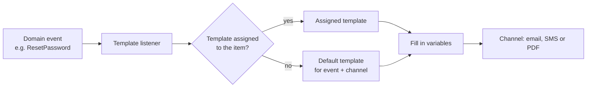

import { Aside, Steps } from "@astrojs/starlight/components";
import Screenshot from "../../../components/Screenshot.astro";

Every message ulams sends to a user, and every certificate it generates, comes from a
template stored in the tenant database. **Configuration → Templates** edits them.

## How events become messages

The [templates](/reference/packages/templates/) package listens to every `Ulams\…` event.
The channel packages register, in code, which events they support and which variables each
event provides: `Template::register(Event, Channel, Variables)`. When a registered event
fires, the listener, for each channel:

1. picks the template **assigned** to the item the event is about, if the event type supports
   assignment (for example a certificate assigned to one course), otherwise the **default**
   template for that event and channel;
2. skips the channel and writes an error to the log if there is no template, or if the
   template is invalid (for example it lacks a required variable);
3. replaces the variables and hands the result to the channel, which sends the email or SMS
   or generates the PDF.

So a message is sent only if a default (or assigned) template exists. Each channel package has
a seeder that creates a default template, named `Default template for event … on … channel`,
for every registered event that has none: `TemplatesEmailSeeder` (run by the API's
`DatabaseSeeder`), `TemplateSmsSeeder` and `TemplatesPdfSeeder`. Tenant provisioning does not
run them, so check the lists on a new tenant. The complete list of events and the template
types registered for them is generated in
[Events and notifications](/reference/events-and-notifications/).

| Channel | Package | Sections you edit | Sent to |
|---|---|---|---|
| Email | [templates-email](/reference/packages/templates-email/) | `title` (subject), `content` (MJML) | the user's email |
| PDF | [templates-pdf](/reference/packages/templates-pdf/) | `title`, `content` (a fabric.js design) | stored as a PDF for the user |
| SMS | [templates-sms](/reference/packages/templates-sms/) | `content` (text) | the user's `phone`; nothing is sent without one |

## The templates screen

| Screen | Route | Permission needed to see it |
|---|---|---|
| Template lists (tabs Email, PDF, SMS) | `/configuration/templates/:template` | `template_read` |
| New or edit template | `/configuration/templates/:template/:id` (`new` for a new template) | `template_read` |

Saving and deleting need `template_create`, `template_update` and `template_delete`;
generating PDFs manually needs `events_trigger`. The tabs can be hidden with the
`hideTemplateTab-email` and `hideTemplateTab-sms` settings, and the PDF tab with
`disable-Certificates` (see [Settings](/admin/settings/)).

<Screenshot name="admin-configuration-templates" alt="The email template list" />

Each list shows ID, creation date, name, event and whether the template is the default, with
**New**, **Edit** and **Delete**.

## Editing a template

<Screenshot name="admin-configuration-templates-template-id" alt="The template form with event, variables and content editor" />

<Steps>

1. Open a tab and click **New**, or **Edit** on a row.
2. Enter a **Name** and choose the **Event**. The event list contains only events registered
   for this channel, and the choice decides which variables you can use.
3. Tick **Set as default template** if this template should be used for the event.
4. Fill in the sections. Above each section the form lists the event's variables; the
   **required variables** must appear in the template, otherwise it is saved as invalid and
   never sent. A new template is pre-filled with the event's default content.
5. Click **Submit**.

</Steps>

### Variables

Variables are written with an `@` prefix, for example `@VarUserName` or `@VarCourseTitle`.
There are two kinds:

- **Event variables**, defined by the variable class registered for the event. The form
  shows them for the selected event (they come from `GET /api/admin/templates/variables`).
- **Global variables** built from the tenant [settings](/admin/settings/): every public,
  enumerable setting that is not of type `json` becomes `@GlobalSettings` followed by its key
  and type in camel case. For example `global.companyName` of type `text` becomes
  `@GlobalSettingsCompanyNameText`. Markdown values are converted to HTML and file and image
  values to URLs.

You can keep recurring blocks, such as an email header and footer, in settings and use them
as global variables in every template. When such a setting changes, the email templates that
use it are rendered again in the background.

### Preview

**Preview** renders the template with mocked variable values and sends the result to you:
the email to your address, the SMS to your phone number. A PDF preview is not sent anywhere.

## Email templates

The `content` section is [MJML](https://mjml.io/), which is rendered to HTML when the
template is saved, not when each email is sent. The renderer is configured on the
**Package Templates Email** tab of [Settings](/admin/settings/) (`ulams_templates_email.mjml.*`):
either the MJML API (`use_api`, `api_url`, `api_id`, `api_secret`) or a local `mjml` binary
(`MJML_BINARY_PATH` in the environment). `default_template` is the MJML wrapper into which the
content is placed (`@VarTemplateContent`).

Email templates exist for events of most packages: account registration, verification,
blocking and deletion, password reset and change, group membership, course access and
deadlines, payments, tasks, webinars and consultations, video processing, users imported from
CSV and invitations of people without an account.

## PDF templates

PDF templates are certificates and other documents designed in a visual editor (fabric.js).
They are registered for `CourseFinished`, so a certificate is generated when a learner
finishes a course, and for the manually triggered event. A certificate can be assigned to a
specific course in the course editor; see [Content creators](/creators/).

For a template of the manually triggered event, the form has **Generate PDF**: choose users
and generate the document for them now. Products have a similar action. Generated PDFs are
listed under the form.

## SMS templates

SMS templates are registered for consultation events (term approved, rejected, reported and
reminders) and the manually triggered event. Sending needs a driver configured on the
**Package Sms** tab of [Settings](/admin/settings/):

- `sms.default`: `twilio`, `requestbin`, or `mail` (sends the text as an email to
  `<phone>@sms.com`, useful only for testing);
- `sms.drivers.twilio.sid`, `token` and `from` for Twilio, or the `TWILIO_SID`,
  `TWILIO_TOKEN` and `TWILIO_FROM` environment variables.

<Aside type="caution">
Templates are data in the tenant database. A template you delete or leave invalid is simply
skipped: the event still happens, but nobody is notified, and the only trace is an error in
the API log.
</Aside>
