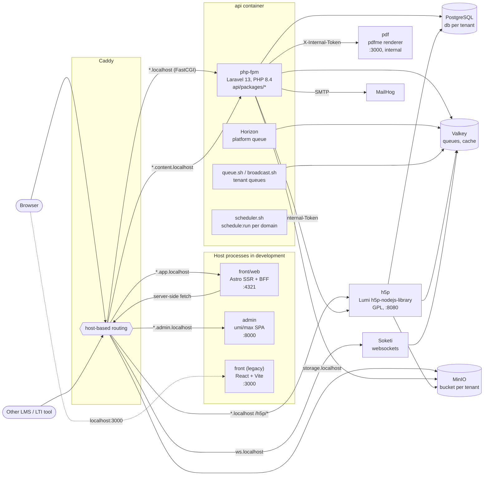
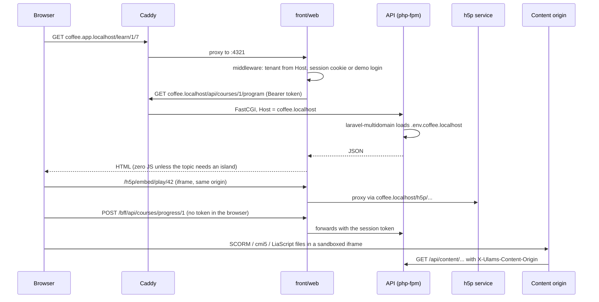

import { Aside, Card, CardGrid } from "@astrojs/starlight/components";

ulams is a headless LMS: one Laravel API serves every tenant, and separate frontends (the Astro
reference frontend, the admin panel and the legacy React app) talk to it over HTTP. Two small Node
services sit next to the API for work that must stay out of PHP: H5P (GPL, isolated) and PDF
rendering. Everything is fronted by Caddy, which picks the backend from the host name.

The development stack is defined in
[`api/docker-compose.yml`](https://github.com/ulams-dev/ulams/blob/main/api/docker-compose.yml)
and [`api/docker/conf/Caddyfile`](https://github.com/ulams-dev/ulams/blob/main/api/docker/conf/Caddyfile).
The admin and the reference frontend run on the host (`yarn dev`) and Caddy proxies to them through
`host.docker.internal`.

## Components

### API (`api`)

A Laravel 13 application on PHP 8.4 (`api/composer.json`), served by php-fpm on port 9000 inside the
`api` container. Almost all domain code lives in the vendored packages under `api/packages/*`,
registered explicitly in `api/config/app.php`; see [API packages](/developers/api-packages/).
Tenancy comes from `gecche/laravel-multidomain`: the host of each request selects a `.env.<host>`
file, so one deployment serves the platform and every tenant with separate databases, buckets and
keys ([Tenancy](/developers/tenancy/)). Authentication is Laravel Passport
([Authentication](/developers/authentication/)).

The same container runs background processes under supervisor (`api/init.sh`, configs in
`api/docker/conf/supervisor/services/`). Each can be switched off with an environment variable:

| Process | What it does | Switch |
|---|---|---|
| `php-fpm` | Serves HTTP through Caddy (FastCGI) | `DISABLE_PHP_FPM=true` |
| `horizon` | `artisan horizon` for the platform queue (not started when `MULTI_DOMAINS` is set) | `DISABLE_HORIZON=true` |
| `multidomain_queue` | `queue.sh`: `queue:work --domain=<host>` for every tenant, re-reading the domain list on every pass; long video jobs use their own connection and queue | `DISABLE_QUEUE=true` |
| `multidomain_broadcast` | `broadcast.sh`: the `broadcast` queue per domain; only started in `MULTI_DOMAINS` mode (`init_multidomains.sh`) | `DISABLE_BROADCAST=true` |
| `scheduler` | `scheduler.sh`: `schedule:run` every minute for the platform and each tenant domain | `DISABLE_SCHEDULER=true` |

The domain list comes from `api/domains.sh` (`MULTI_DOMAINS` plus registered tenants), so a tenant
created at runtime gets workers and scheduled jobs without a restart. Scheduled jobs are listed in
the [scheduled jobs reference](/reference/scheduled-jobs/).

### H5P service (`api-h5p`)

`api/h5p` is a Node service (Express 5) built on Lumi's `@lumieducation/h5p-server` and
`h5p-express`. It serves the H5P player, editor, AJAX endpoints, library administration and a small
REST API. It is GPL-licensed and isolated by [ADR 0003](/decisions/0003-h5p-as-isolated-gpl-service/):
frontends only frame its pages and talk to it over `postMessage`; no H5P code is bundled into the
MIT applications, and lint rules in admin and front block `@lumieducation/*` imports.

- Browsers reach it same-origin at `http://<tenant>.localhost/h5p/*`, which Caddy proxies to
  `h5p:8080`. The reference frontend proxies it once more through its own origin
  ([Reference frontend](/developers/reference-frontend/)).
- It is multi-tenant with `TENANCY_MODE=env-files`: the host selects the tenant's Laravel env file
  (read-only mount of `api/`) for its database credentials, bucket and Passport public key.
- Users are authenticated by verifying the Passport RS256 JWT and calling `GET /api/profile/me` on
  the tenant API; Laravel calls the service with `X-Internal-Token`.
- Content rows live in schema `h5p` of each tenant database, files in the tenant bucket under
  `h5p/`, installed libraries on a shared volume.

The Laravel side is the `h5p` package. Full details: [`api/h5p/README.md`](https://github.com/ulams-dev/ulams/blob/main/api/h5p/README.md).

### PDF service (`api-pdf`)

`api/pdf` renders certificates and PDF templates with [pdfme](https://pdfme.com) (MIT). It replaced
ReportBro. It is internal only: Laravel (`templates-pdf` package) calls `POST /render` with
`X-Internal-Token`; browsers never reach it, and the admin designer loads fonts through
`/api/pdfs/fonts` on the API. Limits on body size, inputs, concurrency and queue length are
environment variables (`PDF_MAX_*`, `PDF_RENDER_TIMEOUT_MS`). See
[`api/pdf/README.md`](https://github.com/ulams-dev/ulams/blob/main/api/pdf/README.md).

### Frontends

<CardGrid>
  <Card title="front/web (reference frontend)">
    Astro SSR on Node, port 4321. Resolves the tenant from the Host header, renders pages on the
    server, and keeps the API token in an httpOnly cookie behind a small BFF. Served on
    `*.app.localhost`. See [Reference frontend](/developers/reference-frontend/).
  </Card>
  <Card title="admin">
    umi/max (React, Ant Design Pro) single-page app, port 8000, served on `*.admin.localhost`. Talks
    to the tenant API directly with a bearer token. See [Administrators](/admin/).
  </Card>
  <Card title="front (legacy)">
    The React 18 + Vite learner app inherited from EscolaLMS, port 3000, reachable directly at
    `http://localhost:3000`. See [Legacy learner app](/developers/legacy-front/).
  </Card>
</CardGrid>

### Backing services

| Service | Image | Used for |
|---|---|---|
| PostgreSQL | `postgres:12` | Platform database `default`; one database and role per tenant (`ulams_<slug>`); schema `h5p` per tenant for the H5P service |
| Valkey | `valkey/valkey:8-alpine` | Queues, cache, Horizon, H5P caches and locks, Soketi adapter. BSD-3-Clause drop-in for Redis; the service is still called `redis` |
| MinIO | `bitnamilegacy/minio` | S3-compatible storage; bucket `ulams` for the platform, `ulams-<slug>` per tenant, public read |
| Soketi | `quay.io/soketi/soketi` | Pusher-protocol websockets on `ws.localhost` (the dev API sets `BROADCAST_DRIVER=log`) |
| MailHog | `mailhog/mailhog` | Catches outgoing mail; web UI on `localhost:8025` |
| mjml | `danihodovic/mjml-server` | MJML API for e-mail templates (`templates-email`, used when `MJML_API_URL` is set) |
| Adminer | `adminer` | Database UI on `localhost:8078` |
| ClamAV | `clamav/clamav:1.4` | Optional upload scanning (`UPLOADS_SCANNER=clamd`), compose profile `av` |

<Aside type="note">
  The PHP image includes `ffmpeg` for HLS conversion in the `video` package but not Node.js or the
  `mjml` binary (`api/docker/php/README.md`). Images and their licences are covered in
  [Container images](/developers/container-images/).
</Aside>

## Hosts and request flow

Caddy decides everything from the host name. In development all names are under `localhost`; the
production names are set per deployment ([Hosts](/getting-started/hosts/)).

| Host | Goes to | Notes |
|---|---|---|
| `api.localhost`, `<slug>.localhost` | `/h5p/*` → `h5p:8080`; everything else → `api:9000` (FastCGI) | Tenant API. Upload routes for SCORM, cmi5 and course zips accept up to 1100 MB; the rest 600 MB. The `_token` query and auth headers are redacted from the access log |
| `<slug>.app.localhost`, `app.localhost` | host `:4321` | Reference frontend (`front/web`); report-only CSP |
| `<slug>.admin.localhost` | host `:8000` | Admin panel; report-only CSP |
| `<slug>.content.localhost`, `content.localhost` | `api:9000` as `GET /api/content/...` | Content origin: only `GET`/`HEAD` on `/scorm/*`, `/cmi5/*`, `/adapt/*`, `/liascript/*`; cookies and auth headers stripped; own CSP |
| `storage.localhost` | `minio:9000` | Public bucket files; `nosniff`, SVG served with `script-src 'none'; sandbox` |
| `minio.localhost` | `minio:9001` | MinIO console |
| `ws.localhost`, `metrics.localhost` | `soketi:6001`, `soketi:9601` | Websockets and Soketi metrics |

### A learner opens a lesson

Third-party package code (SCORM, cmi5, Adapt builds, LiaScript) never runs on the API, front or
admin origins: it is served from the per-tenant content origin, which holds no cookies and no API.
How the SCORM player gets a scoped tracking token is described in
[`api/docs/content-origin.md`](https://github.com/ulams-dev/ulams/blob/main/api/docs/content-origin.md)
and summarised in [Tenancy](/developers/tenancy/#content-origin).

### Server-to-server calls

| From | To | Authentication |
|---|---|---|
| front/web | tenant API | Passport bearer token from the session cookie |
| API | h5p service (`LARAVEL_H5P_SERVICE_URL`) | `X-Internal-Token` (`H5P_INTERNAL_TOKEN`) |
| h5p service | tenant API through Caddy (`LARAVEL_API_URL`) | the learner's token, for `GET /api/profile/me` |
| API | pdf service (`LARAVEL_PDF_SERVICE_URL`) | `X-Internal-Token` (`PDF_INTERNAL_TOKEN`) |
| API | Adapt build worker (`ADAPT_BUILDER_URL`) | `X-Internal-Token`; the worker is not built yet ([ADR 0013](/decisions/0013-adapt-build-worker/)) |

## Not in the stack yet

The roadmap adds a Sylius 2.x commerce service, which does not exist in the code yet. The LLM layer
and Course Builder are built (Phase 2, M2.1); see [LLM layer](/developers/llm-layer/) and the [roadmap](/roadmap/).
Production topologies (separate workers, replicas, managed databases) are covered in
[High availability](/operators/high-availability/).
