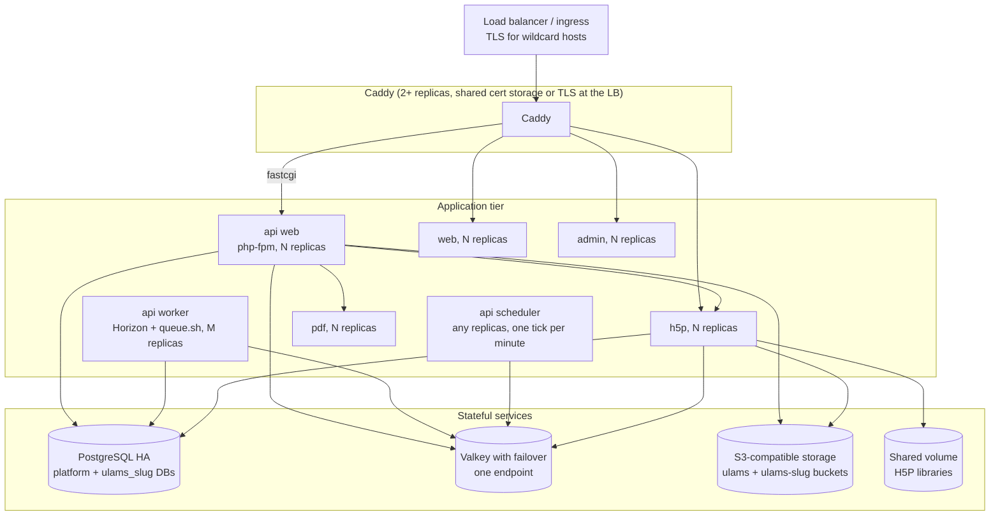

import { Aside, Badge, LinkCard } from "@astrojs/starlight/components";

<Aside type="caution" title="Not tested">
  ulams is developed and tested on a single host. This page describes how the existing runtime can
  be replicated, based on what the code does today, and lists the gaps. The decision record is
  [ADR 0021](/decisions/0021-ha-reference-architecture/) (status: Proposed).
</Aside>

## What holds state

| Component | State | Can run several replicas? |
|---|---|---|
| API web (php-fpm) | Platform `.env` built from `LARAVEL_*`; tenant env files, domain registrations and Passport keys rebuilt from the `tenants` table on start; sessions use the `cookie` driver; cache in Redis | Yes, with the rules below |
| API workers (Horizon, `queue.sh`) | Jobs in Redis | Yes |
| API scheduler (`scheduler.sh`) | None; each minute is claimed with a lock in the shared cache | Yes, if the cache is shared (Valkey) |
| H5P service | Installed libraries on a local volume (`/data/libraries`); content in the tenant bucket and the tenant database (`h5p` schema); editor temporary files in the bucket; caches and locks in Redis; multipart uploads in `/tmp/h5p` during one request | Yes, if the library volume is shared |
| PDF service | None | Yes |
| Learner front (`web`) | In-memory cache of public API data (`ULAMS_CACHE_TTL`, 45 s) | Yes; replicas may differ for up to the TTL |
| Admin, older front | Static files | Yes |
| PostgreSQL | Platform database and one database per tenant | Through a HA setup |
| Valkey | Queues, cache, locks, H5P caches | Through a HA setup |
| Object storage | All files | Through the provider |
| API `storage/` | Local disks (`SCORM_DISK=local` by default), logs, generated keys | Must not hold anything only one replica has |

## Reference topology

<Badge text="Recommended" variant="tip" />

### API roles from one image

The `api` image runs everything under supervisord; the `DISABLE_*` variables of `init.sh` select
what a container does:

| Role | Variables | Replicas |
|---|---|---|
| web | `DISABLE_HORIZON=true`, `DISABLE_QUEUE=true`, `DISABLE_SCHEDULER=true`, `DISABLE_DB_MIGRATE=true` | N, behind Caddy |
| worker | `DISABLE_PHP_FPM=true`, `DISABLE_SCHEDULER=true`, `DISABLE_DB_MIGRATE=true` | M |
| scheduler | `DISABLE_PHP_FPM=true`, `DISABLE_HORIZON=true`, `DISABLE_QUEUE=true`, `DISABLE_DB_MIGRATE=true` | 1, or more for failover |
| migration job | the image with `php artisan migrate --force && php artisan ulams:tenant:sync-env --migrate` as command | one run per deploy |

With `DISABLE_DB_MIGRATE=true`, `init.sh` still runs `ulams:tenant:sync-env` (without
`--migrate`), so every replica rebuilds the tenant env files and keys it needs.

- **Scheduler.** `scheduler.sh` runs `ulams:tenant:schedule-loop` for the platform and every
  tenant. Every replica wakes at the start of each minute and takes an atomic lock
  `ulams:schedule-tick:<tenant or platform>:<YmdHi>` in the cache store (Valkey, prefixed per
  tenant); the replica that gets it runs the minute's `schedule:run`, the others skip that minute,
  so reminders and daily jobs run once however many scheduler containers there are. Run two for
  failover. The lock needs a shared cache store that supports locks (Redis/Valkey, database,
  Memcached); with the `file` or `array` store each replica would have its own lock. If the
  replica holding a minute dies mid-tick, that minute's tasks are skipped; the next minute is
  taken by whichever replica gets there first (see [Queues and the scheduler](/operators/queues-and-scheduler/#the-scheduler-and-its-minute-lock)). `TENANCY_SCHEDULER_LOCK=false` turns the lock off
  (a deliberate second scheduler). `ulams:tenant:schedule-loop --once` is a manual tick and
  ignores the lock. The demo reset also keeps its `withoutOverlapping()` lock in the cache.
- **Workers.** Horizon handles the platform queues (`default`, the builder queue and the long-job
  queue); `queue.sh` starts long-lived `queue:work` processes for every tenant host (default,
  builder and long-job, each on a connection whose `retry_after` is above its job timeout) and
  re-reads the tenant list every 10 seconds. All of them pop jobs atomically from Redis, so several
  worker replicas are safe. Horizon is installed (`laravel/horizon`) and only supervises the
  platform queues; tenant queues are not visible in its dashboard. Details and variables:
  [Queues and the scheduler](/operators/queues-and-scheduler/).
- **Migrations.** `init.sh` runs `migrate --force` on every start without `--isolated`, and
  `sync-env --migrate` migrates tenants one after another. Run them once per deploy as a job, not
  in every replica.

### Keys and secrets across replicas

- **Platform**: `APP_KEY`, `JWT_PRIVATE_KEY_BASE64` and `JWT_PUBLIC_KEY_BASE64` must be identical
  on every replica (a secret store or Kubernetes Secret). Without the key pair a fresh container
  generates its own Passport keys (never a new `APP_KEY` while one is configured), see
  [Self-hosting](/operators/self-hosting/#what-happens-when-the-api-container-starts).
- **Tenants**: each tenant's Passport keys, `APP_KEY` and database password are stored encrypted
  in the `tenants` table and written to `storage/<host>/` and `.env.<host>` by
  `ulams:tenant:sync-env`. Every replica that ran the sync has them.
- **New tenants**: `ulams:tenant:create` writes the env file and keys on the container where it
  runs. Other API replicas answer 404 for the new host until they run
  `php artisan ulams:tenant:sync-env` or restart; the same goes for the H5P replicas, which read
  the env files. Roll the deployments (or exec the sync on each replica) after creating or
  deleting a tenant.

### H5P service replicas

Share between replicas:

- the library volume `/data/libraries` (installing or deleting a content type affects every
  tenant): a ReadWriteMany volume, or the same libraries installed on every replica and Hub
  installs turned off (`H5P_HUB_ENABLED=false`);
- the Laravel env files (`ENV_DIR`) and Passport public keys (`KEYS_DIR`), read-only;
- Redis (library and content-type caches, the lock provider) and the buckets, which are shared
  anyway.

`/tmp/h5p` only holds an upload while its request runs and needs no sharing.

<Aside type="caution" title="Getting env files to the H5P service">
  The env files live inside the API container (`/var/www/html/.env*`). The single-server example
  copies them to a volume with a small loop; in a cluster you need the same idea, for example one
  API replica (or a sidecar running the API image) that writes them to a ReadWriteMany volume
  mounted read-only by the H5P pods. There is no built-in mechanism yet.
</Aside>

### PostgreSQL

All tenant databases live on the cluster the platform connects to: `ulams:tenant:create` creates
them through the `pgsql_admin` connection (`DB_ADMIN_*`, default `DB_*`) and writes the
platform's `DB_HOST` into the tenant env file. Use a managed PostgreSQL with automatic failover or
Patroni, and give the application **one writer endpoint** (a DNS name or virtual IP that follows
the primary).

- Connections add up: every php-fpm worker opens one per request, and the H5P service keeps a
  pool of up to `TENANT_DB_POOL_MAX` (5) per tenant per replica. A pooler such as PgBouncer in
  front of the cluster keeps the count manageable; test Laravel and the H5P service with your
  pooling mode first.
- Read replicas are not used by the application.
- Backups and PITR: see [Backups](/operators/backups/).

### Valkey and per-tenant key prefixes

Every tenant uses the same Redis-protocol server as the platform. Separation is by key prefix,
written into each tenant env file by `ulams:tenant:create`:

| Prefix | Used for |
|---|---|
| `REDIS_PREFIX=ulams_<slug>_` | Every Laravel Redis key: queues, locks |
| `CACHE_PREFIX=ulams_<slug>_cache` | The cache store (Redis database `REDIS_CACHE_DB`, default 1) |
| `HORIZON_PREFIX=ulams_<slug>_horizon:` | Horizon metadata |
| `h5p:` and `h5p:t:<tenant>:` | The H5P service |

Consequences: a tenant cannot be moved to its own Redis by configuration (the sync rebuilds its env
file with the platform's `REDIS_HOST`); `ulams:tenant:delete` removes a tenant's keys by prefix;
and because queues and locks share the instance with the cache, configure
`maxmemory-policy noeviction` so queued jobs are never evicted.

The configuration (`config/database.php`) knows a single host, port and password. Use a managed
service or Valkey with Sentinel **behind one endpoint** that follows the primary. Redis Sentinel
discovery and Redis Cluster are not configured and not supported today.

### Object storage

Use an S3-compatible service with its own redundancy. Set `SCORM_DISK=s3` so that no package files
live on a single API replica's disk, and check other disks you configure (`LIASCRIPT_DISK`
defaults to `FILESYSTEM_DRIVER`).

### Proxy and TLS

Caddy routes by host, talks FastCGI to php-fpm and implements the content-origin rules, so keep it
(or reproduce those rules) in a cluster. Several Caddy replicas need a shared certificate storage
backend, or let the load balancer or cert-manager terminate TLS with wildcard certificates
(DNS-01) and run Caddy on plain HTTP behind it. Point its `api:9000`, `h5p:8080`, `web:4321` and
`admin:8080` upstreams at the replicated services. The same rules add the `__Host-`-safe headers
for the same-site content mode (`Cross-Origin-Resource-Policy: same-origin` on the app JSON,
`Cross-Origin-Opener-Policy` on the content origin), so a replacement proxy must reproduce them;
forward the original `Origin` and `X-Forwarded-Proto` headers unchanged, because the exact-Origin
checks and the `__Host-` cookies depend on them.

## Zero-downtime deploys and migrations

Rolling updates work only if the database schema after the migration still works with the
previous release, because old pods keep serving while the migration job runs. The project does not
guarantee backward-compatible migrations between commits; until it does, plan a short
maintenance window or check each release's migrations (expand first, remove later). Tenant
migrations run one tenant after another, so tenants can be on different schema versions for the
duration of the job; the H5P service migrates its schema per tenant on first use.

## Kubernetes

<Badge text="Coming" variant="caution" /> There is no Helm chart yet. A deployment needs:

- Deployments for API web, API worker, H5P, PDF, web, admin and Caddy; an API
  scheduler (one replica is enough; more are safe thanks to the per-minute lock); a migration Job per release.
- Secrets for `APP_KEY`, the platform key pair, database, Valkey, S3 and SMTP credentials and the
  internal tokens; the `LARAVEL_*` variables as a ConfigMap.
- A ReadWriteMany volume for the H5P libraries and one for the env files shared with H5P.
- Wildcard DNS and certificates (cert-manager with DNS-01) for the four host families.
- Probes on `/h5p/health`, `/health` (pdf), `/healthz` (web) and php-fpm; add the Service and
  probe host names to `TENANCY_PLATFORM_HOSTS`, or the API answers them with 404.

The stub `api/docs/high-availability.md` still points at the Kubernetes templates of the old
EscolaLMS project; they predate the tenancy package and do not apply.

<LinkCard title="ADR 0021: High-availability reference architecture" href="/decisions/0021-ha-reference-architecture/" />
